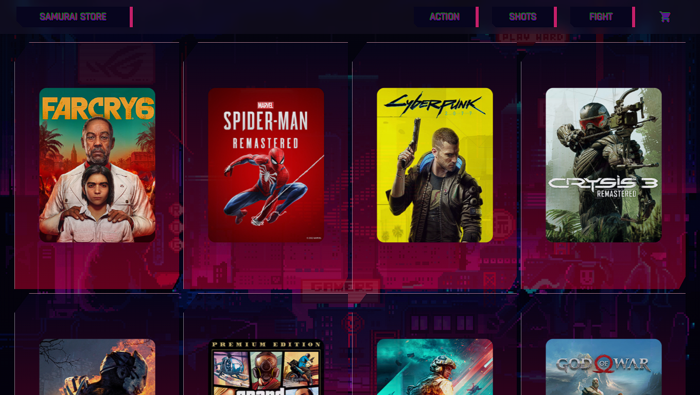

<!DOCTYPE html>
<html>
  <head>
    <mate charest="utf-8" />
  </head>
  <body>
    

      <h1>
        <b><i>SAMURAI STORE</i></b>
      </h1>
      
      <h2>Ecommerce de juegos</h2>
      <h3><a href="https://samurai-games.vercel.app/">Ver sitio web</a></h3>
      
    

    

 

      <h2>INSTALACION:</h2>
      <ul>
        <li>git clone https://github.com/BrianGaray/coder-react-BrianGaray</li>
        <li>npm install</li>
        <li>npm start / npm run build</li>
      </ul>
    

    

      <h2>LIBRERIAS UTILIZADAS:</h2>
      <ul>
          <h3><a href="https://reactrouter.com/en/main">React Router Dom</a></h3>
        <li>npm install react-router-dom</li>
          <h3><a href="https://firebase.google.com/">Firebase</a></h3>
        <li>npm install firebase</li>
      </ul>
    

    

      <h2>TRABAJO REALIZADO:</h2>
      
App de navegación sencilla que simula una tienda de videojuegos

      <h4>Componentes:</h4>
      <ul>
        <li>Navbar</li>
        <li>Catálogo</li>
        <li>Detalle de producto</li>
        <li>CartContext</li>
        <li>CartWidget</li>
        <li>Formulario de compra</li>
      </ul>
         <h2>POR ULTIMO DEPLOY EN VERCEL:</h2>
      <h3><a href="https://vercel.com/">Vercel</a></h3>
    

  </body>
</html>

